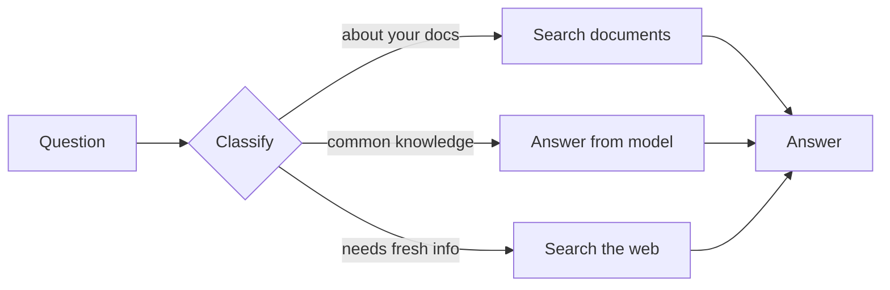
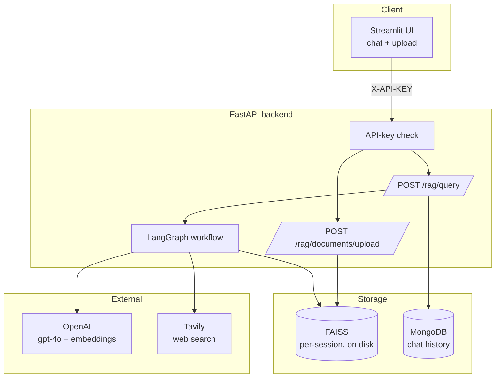
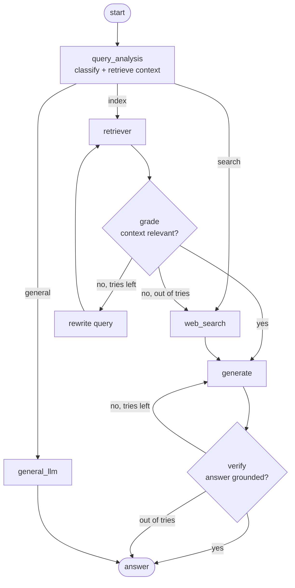
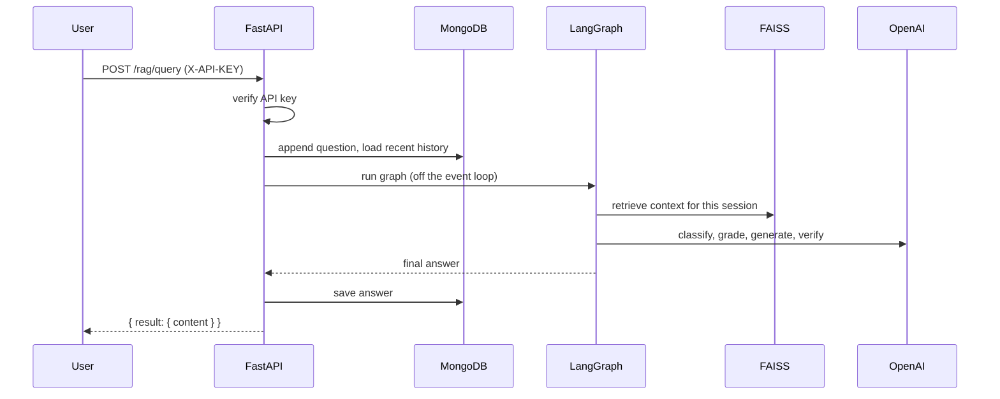
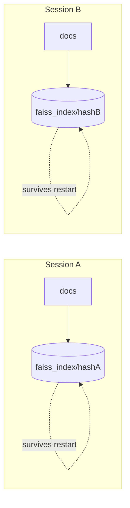

# Adaptive RAG

An answering engine that picks a strategy per question. Ask something about a document you uploaded and it reads the document. Ask general knowledge and it answers directly. Ask about something current and it searches the web. Before it replies on the document path, it checks that the answer is actually supported by the source.

Stack: FastAPI, LangGraph, FAISS, MongoDB, OpenAI, Tavily, Streamlit.

---

## The idea in one picture



The value is the classifier plus the checks around retrieval. Instead of always stuffing documents into the prompt, the system decides whether documents are even the right source, and if they are, it confirms the retrieved text is relevant and the answer is grounded in it.

---

## Architecture



Every request must carry a valid `X-API-KEY`. Uploaded documents are embedded and written to a per-session FAISS index on disk. Chat history lives in MongoDB.

---

## The decision graph

This is the actual LangGraph workflow. Both retry loops are bounded so the graph always terminates.



| Node | Job |
|------|-----|
| `query_analysis` | Classifies the question as index, general, or search, and retrieves context once. |
| `retriever` | Reuses that context on the first pass; re-retrieves only after a rewrite. |
| `grade` | Judges whether the retrieved text is relevant to the question. |
| `rewrite` | Rephrases the question to retrieve better. Capped, then falls back to web search. |
| `web_search` | Pulls fresh results from Tavily. |
| `generate` | Writes the final answer from the context. |
| `verify` | Confirms the answer is supported by the context. Capped regeneration. |
| `general_llm` | Answers directly for common-knowledge questions. |

---

## Anatomy of a request



The graph runs in a worker thread so a slow answer does not block other requests. Only the most recent slice of chat history is loaded, not the whole conversation.

---

## Data and isolation



Each `session_id` gets its own FAISS index, stored under a hashed folder name. One user's upload cannot overwrite or leak into another's, and indexes are reloaded from disk when the server starts again.

---

## Requirements

- Python 3.9+
- MongoDB running at `mongodb://localhost:27017`
- OpenAI API key
- Tavily API key

---

## Setup

```bash
# 1. install
python -m venv venv
source venv/bin/activate            # Windows: venv\Scripts\activate
pip install -r requirements.txt

# 2. create .env in the project root
cat > .env <<'EOF'
OPENAI_API_KEY=your_openai_key
TAVILY_API_KEY=your_tavily_key
RAG_API_KEY=pick_a_shared_secret
FAISS_INDEX_PATH=faiss_index
EOF

# 3. make sure MongoDB is running on localhost:27017
```

`RAG_API_KEY` is mandatory. The API fails closed, so without it every request returns 401.

---

## Run

```bash
# backend
python -m uvicorn src.main:app --reload --port 8000
# docs at http://localhost:8000/docs

# frontend (optional)
export RAG_API_KEY=pick_a_shared_secret
streamlit run streamlit_app/home.py
# UI at http://localhost:8501
```

> The Streamlit login calls an external auth service at `localhost:8080` that is not in this repo, so UI login will not work by itself. The backend runs standalone, so the quickest way to try the system is calling the API directly.

---

## Use the API

Send `X-API-KEY` on every call. Any string works as `session_id`; documents and history are tied to it.

**Upload a document**

```bash
curl -X POST http://localhost:8000/rag/documents/upload \
  -H "X-API-KEY: pick_a_shared_secret" \
  -H "X-Session-Id: user123" \
  -H "X-Description: my resume" \
  -F "file=@resume.pdf"
```

**Ask a question**

```bash
curl -X POST http://localhost:8000/rag/query \
  -H "X-API-KEY: pick_a_shared_secret" \
  -H "Content-Type: application/json" \
  -d '{"query": "what was my most recent role?", "session_id": "user123"}'
```

### Endpoints

| Method | Path | Headers | Body / form |
|--------|------|---------|-------------|
| POST | `/rag/query` | `X-API-KEY` | JSON: `query`, `session_id` |
| POST | `/rag/documents/upload` | `X-API-KEY`, `X-Session-Id`, `X-Description` | form: `file` (PDF or TXT) |

---

## Configuration

| Variable | Required | Purpose |
|----------|----------|---------|
| `OPENAI_API_KEY` | yes | LLM and embeddings |
| `TAVILY_API_KEY` | yes | Web search |
| `RAG_API_KEY` | yes | Shared secret sent as `X-API-KEY` |
| `FAISS_INDEX_PATH` | no | Where indexes are saved (default `faiss_index`) |

Tunable in code: chunk size 1000 with 150 overlap (`document_upload.py`), rewrite and regeneration caps (`graph_tools.py`), history window of 20 messages (`chat_history_mongo.py`). Prompts are in `src/config/prompts.yaml`.

---

## Project layout

```
src/
  main.py                 FastAPI entry point
  api/routes.py           query + upload endpoints
  core/                   config, security (API key), logging
  db/mongo_client.py      MongoDB connection
  llms/openai.py          gpt-4o setup
  memory/                 MongoDB chat history (windowed)
  models/                 Pydantic schemas
  rag/
    graph_builder.py      the LangGraph workflow and nodes
    retriever_setup.py    per-session FAISS + persistence
    document_upload.py    parse, chunk, embed
  tools/graph_tools.py    routing + verification logic
  config/prompts.yaml     all prompts
streamlit_app/            chat UI + backend client
```

---

## Tech stack

| Part | Tool |
|------|------|
| API | FastAPI + Uvicorn |
| Workflow | LangGraph / LangChain |
| Vector store | FAISS (persisted to disk) |
| LLM + embeddings | OpenAI gpt-4o |
| Web search | Tavily |
| Chat history | MongoDB via Motor |
| UI | Streamlit |

---

## Limitations and next steps

- Streamlit login needs an external auth service (`localhost:8080`) that ships separately.
- The MongoDB URL is hardcoded in `src/db/mongo_client.py`.
- Qdrant code exists but is disabled; FAISS is the active backend.
- No automated tests yet.

`PROJECT_EVALUATION.md` tracks the open items and design notes in detail.

---

## Author

Tejal Palwankar
